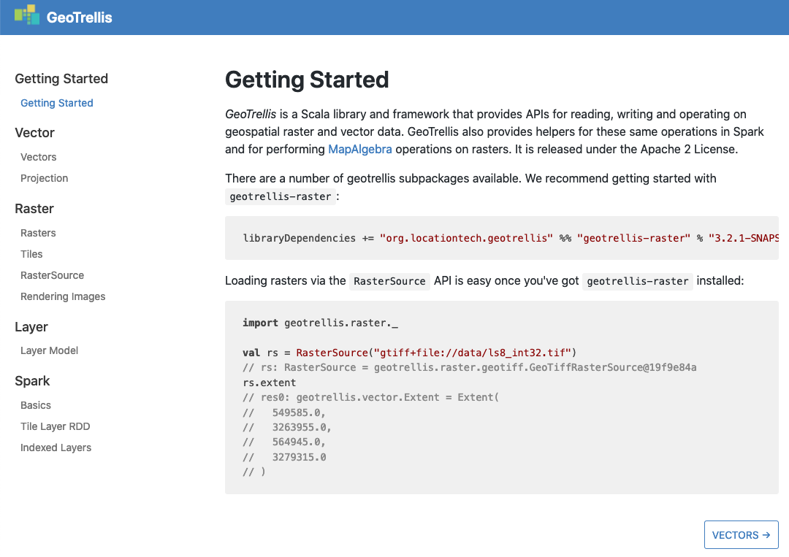
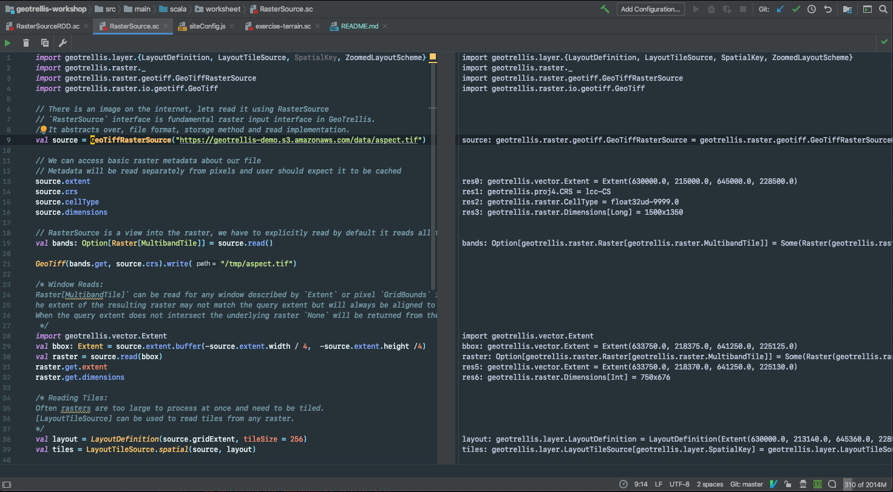
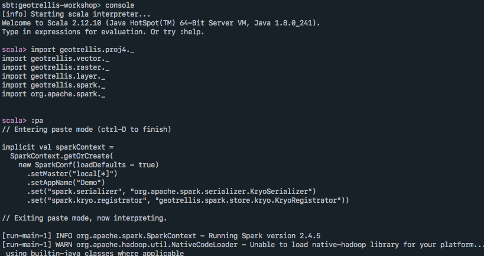

# GeoTrellis Workshop


## Contents

This repository contains several types of workshop material that is intended to share code, data and examples.

### Docs

[docs](docs) is used to generate the [https://geotrellis.github.io/geotrellis-workshop](https://geotrellis.github.io/geotrellis-workshop) site.



These documents are meant to be used as a mixture of workshop specific reference and walkthroughs. The sections contain all the required import and are intended to be copy pasted either into Scala Workbook or Jupyter Notebook. The workshop presenter select and discuss sections in detail acording the the schedule or as questions come up.


### Scala Worksheets

[src/main/scala/worksheet](src/main/scala/worksheet) contains IntelliJ worksheets that accompany the material in modules.



To access these worksheets checkout and open this repository in IntelliJ IDEA and browse to the worksheet folder. These worksheets can be evaluated REPL style and IntelliJ can be used for code navigation. These worksheets will be used for hands-on section of Scala concepts and GeoTrellis types.

*Note*: It is currently not possible to run Spark worksheets that use function closures.

### SBT Console



SBT console can be accesed with:

```sh
sbt console
```

SBT console is an important part of normal spark development cycle and has access to all the classes and data available in this workshop. This is a fallback place to illusrate spark concepts and work with RDDs in a REPL.

### Data

`s3://geotrellis-demo/` bucket contains the data intended for use in this workshop. Mostly it will be accessed directly through AWS S3 SDK.

- `s3://geotrellis-demo/cogs/harrisburg-pa/` holds a number of overlapping GeoTiffs for a study area covering Harrisburg, PA, USA. Useful for exploring basic raster functionality and MapAlgebra.
- `s3://geotrellis-demo/baja-2019/` holds a monthly median pixel mosaic for 2018 from Sentinel library for AOI over Baja, CA. Chosen for its interesting landscape and cloud-free days. Useful for building temporal layers and building time series analsysis.
- [Mapzen Terrain Tiles](https://registry.opendata.aws/terrain-tiles/) are read directly from AWS and can be accessed through `workshop.data.TerrainTiles` class
- [Landsat 8 Scenes](https://registry.opendata.aws/landsat-8/) are read directly from AWS.

### Supporting Material

- [`GeoTrellis Server Documentation`](https://github.com/geotrellis/geotrellis-server/tree/develop/ogc-example)
- [`geotrellis-spark-job`](https://github.com/geotrellis/geotrellis-spark-job.g8) SBT project template
- [`geotrellis-landsat-tutorial`](https://github.com/geotrellis/geotrellis-landsat-tutorial)