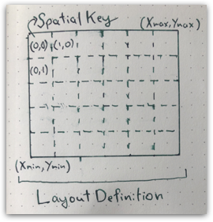

`SpatialKey` refers to a tile in a `LayoutDefinition`, a regular grid of tiles covering a geographic area:



Note that the spatial keys are indexed from upper left while map bounding box is indexed from lower left. The spatial key convention is consistent with pixel column and row indexes of a raster while the map convention is conistent with cartisian (X,Y) plane. `SpatialKey` instances has a map position only through corresponding `LayoutDefinition`.

```scala mdoc
import geotrellis.layer.{ LayoutDefinition, SpatialKey }
import geotrellis.raster.GridExtent
import geotrellis.vector.{ Extent, Point, LineString }

val layout = LayoutDefinition(
  grid = GridExtent(Extent(0, 0, 100, 100), cols = 100, rows = 100),
  tileCols = 10, tileRows = 10
)

// lower left, upper left, upper right, lower right:
SpatialKey(0, 9).extent(layout)
SpatialKey(0, 0).extent(layout)
SpatialKey(9, 0).extent(layout)
SpatialKey(9, 9).extent(layout)

```

`MapKeyTransform` instance on `LayoutDefinition` has various utility methods to transition from tile addressing to map addressing:

```scala mdoc
layout.mapTransform.pointToKey(Point(5, 5))
layout.mapTransform.pointToKey(Point(15, 15))
layout.mapTransform.keyToExtent(SpatialKey(1,8))
layout.mapTransform.extentToBounds(Extent(5, 5, 15, 15))
layout.mapTransform.keysForGeometry(LineString(Point(5,5), Point(25,5)))
```

Webmaps use a tile pyramid where each zoom level produce a power of two reduction in map pixel count. You can use `ZoomedLayoutScheme` to generate layout definitions.

```scala mdoc
import geotrellis.layer.ZoomedLayoutScheme
import geotrellis.proj4.WebMercator

val scheme = ZoomedLayoutScheme(WebMercator, tileSize = 256)

val zoom7 = scheme.levelForZoom(7).layout
val zoom8 = scheme.levelForZoom(8).layout

val ottawaWM = Extent(-8621691, 5604373, -8336168, 5805297)
val tileBounds = zoom7.mapTransform.extentToBounds(ottawaWM)
val tileExtent = zoom7.mapTransform.boundsToExtent(tileBounds)

// Note that this is snapping out extent to closest tile borders
tileExtent.contains(ottawaWM)
ottawaWM.contains(tileExtent)

// These X/Y keys will cover Ottawa on a slippy map at zoom 7
zoom8.mapTransform.keysForGeometry(ottawaWM.toPolygon())
```